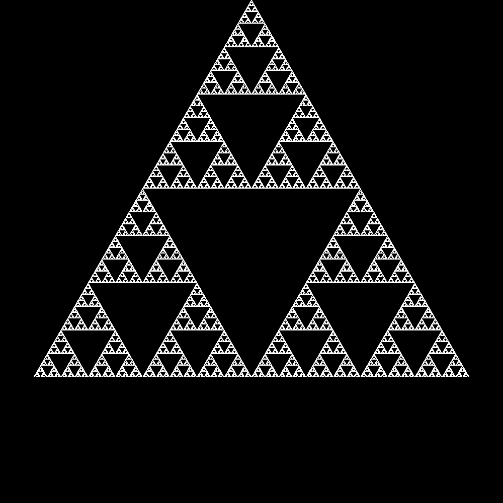

# Chaos Game Fractal Generator

A simple command-line application written in Rust for generating fractals using the 'Chaos Game' algorithm.

The algorithm works as follows:

1. Define the $n$ vertices of a regular polygon
2. Choose a random initial point within the polygon
3. Select one of the polygon's vertices at random
4. Move the current point a specific ratio, $r$, of the distance towards the chosen vertex
5. Repeat steps 3 and 4 for some large number of iterations, plotting each new point

By adjusting the number of vertices, the distance ratio, and optionally adding additional
restrictions to the choice of vertices, a huge variety of intricate fractal patterns can be generated.

More details on the algorithm can be found [here](https://en.wikipedia.org/wiki/Chaos_game). 

## Gallery

Below are some example fractals generated with this application.

| Fractal                 | Parameters                                                                                                    | Image                                                    |
|:------------------------|:--------------------------------------------------------------------------------------------------------------|:---------------------------------------------------------|
| **Sierpiński Triangle** | $n=3$, $r=0.5$                                                                                                |  |
| **Rainbow Hex Fractal** | $n=6$, $r=0.5$                                                                                                |                  |
| **Spirals Fractal**     | $n=5$, $r=0.5$, Rule: Cannot pick the same vertex twice in a row.                                             |                          |
| **Star Fractal**        | $n=5$, $r=0.5$, Rule: If a vertex is picked twice in a row, the next pick cannot be a direct neighbour of it. |                        |