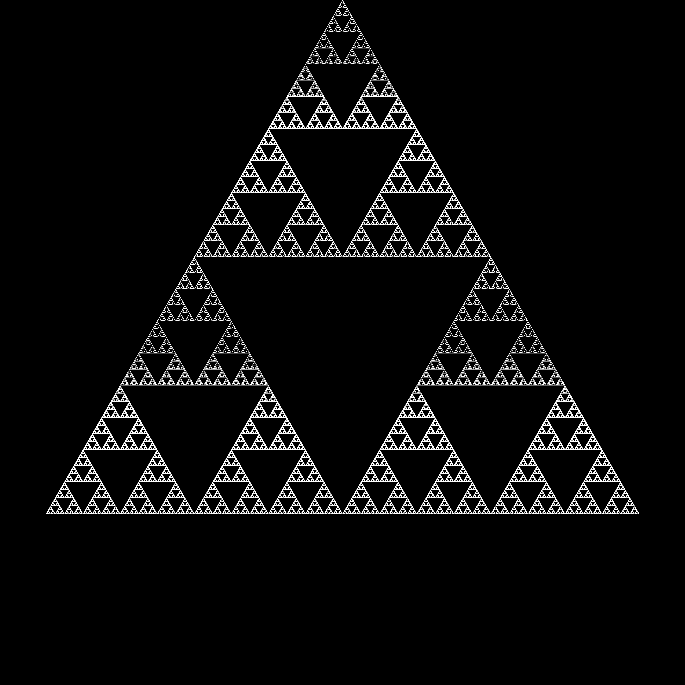

# Chaos Game Fractal Generator

A simple command-line application written in Rust for generating fractals using the 'Chaos Game' algorithm.

## Table of Contents

- [Algorithm Description](#algorithm-description)
- [Gallery](#gallery)
- [Installation](#installation)
- [Usage](#usage)
  - [Basic Example](#basic-example)
  - [Command-Line Arguments](#command-line-arguments)
  - [Custom Rules](#custom-rules)
- [License](#license)

## Algorithm Description

This application generates fractals using the following simple, iterative algorithm:

1. Define the $n$ vertices of a regular polygon
2. Choose a random initial point within the polygon
3. Select one of the polygon's vertices at random
4. Move the current point a specific ratio, $r$, of the distance towards the chosen vertex
5. Repeat steps 3 and 4 for some large number of iterations, plotting each new point

By adjusting the number of vertices, the distance ratio, and optionally adding additional
restrictions to the choice of vertices, a huge variety of intricate fractal patterns can be generated. More details on the algorithm can be found [here](https://en.wikipedia.org/wiki/Chaos_game). 

## Gallery

Below are some example fractals generated with this application.

| Fractal                 | Parameters                                                                                                    | Image                                                    |
|:------------------------|:--------------------------------------------------------------------------------------------------------------|:---------------------------------------------------------|
| **Sierpiński Triangle** | $n=3$, $r=0.5$                                                                                                |  |
| **Rainbow Hex Fractal** | $n=6$, $r=0.5$                                                                                                |                  |
| **Spirals Fractal**     | $n=5$, $r=0.5$, Rule: Cannot pick the same vertex twice in a row.                                             |                          |
| **Star Fractal**        | $n=5$, $r=0.5$, Rule: If a vertex is picked twice in a row, the next pick cannot be a direct neighbour of it. |                        |

## Installation

1. Clone the repository:
   ```shell
   git clone https://github.com/benjaminrall/chaos-game.git
   ```
2. Navigate to the project directory:
   ```shell
   cd chaos-game
   ```
3. Build the project:
   ```shell
   cargo build --release
   ```
The executable will then be available at `target/release/chaos-game`.

## Usage

You can run the program from the command line, providing arguments to customise the generated fractal.

### Basic Example

This basic example generates the Sierpiński triangle, one of the most well-known fractals
produced by the Chaos Game.
```shell
./target/release/chaos-game -n 3 -r 0.5 -o sierpinski.png
```

### Command-Line Arguments

You can see all available options by running the application with the `--help` flag.

| Option              | Short Flag | Description                                                 | Default Value |
|:--------------------|:-----------|:------------------------------------------------------------|:--------------|
| `--sides`           | `-n`       | The number of sides of the fractal polygon.                 | `3`           |
| `--ratio`           | `-r`       | The distance ratio for point interpolation (0.0 to 1.0).    | `0.5`         |
| `--iterations`      | `-i`       | The total number of iterations to run the algorithm for.    | `100,000,000` |
| `--output`          | `-o`       | The output filename for the final PNG image.                | `output.png`  |
| `--coloured`        | `-c`       | A flag to generate coloured fractals based on vertex angle. | `false`       |
| `--colour-scale`    |            | An aesthetic parameter to control image brightness.         | `4.0`         |
| `--image-size`      |            | The width and height of the square image in pixels.         | `1000`        |
| `--rotation-offset` |            | An initial rotation for the polygon in degrees.             | `0.0`         |
| `--rule`            |            | The name of the rule to use for selecting vertices.         | `"default"`   |

### Custom Rules
The application is designed to be easily extensible with custom rules for generating more complex fractals.
Rules consist of a function acting on some history of previous points and a proposed new point, and must
return a boolean indicating whether the new point is valid.

To create your own rule, follow these steps:

1. **Create a file for your new rule:**
    
    Create a new file in the `chaos-game/src/rules/` directory (e.g., `my_rule.rs`)

2. **Write your rule function:**
    
    Inside the new file, write a function that takes the history of previous points and a proposed new point, and
    returns whether the point is valid. Decorate it with the `#[rule]` attribute, giving it a unique name and
    specifying how much history it needs.
    ```rust
    // chaos-game/src/rules/my_rule.rs
    use std::collections::VecDeque;
    use chaos_game_macros::rule;
    use crate::types::Vertex;

    // An example rule that doesn't allow the same vertex to be selected twice in a row
    #[rule("my-rule", history = 1)]
    fn no_repeats(previous_points: &VecDeque<&Vertex>, new_point: &Vertex) -> bool {
      if previous_points.len() == 0 {
        return true;
      }
      previous_points[0].index != new_point.index
    }
    ```

3. **Add your rule to the rules module:**
    
    Inside `chaos-game/src/rules/mod.rs`, define your module's filename (e.g. `mod my_rule;`)

4. **Rebuild and use:**

    Rebuild the application with `cargo build --release`. The new rule will be automatically registered
    and available to use from the command line:
    ```shell
    ./target/release/chaos-game -n 5 -c --rule my-rule
    ```

## License

This project is licensed under the **MIT License**. See the [`LICENSE`](./LICENSE) file for details.
